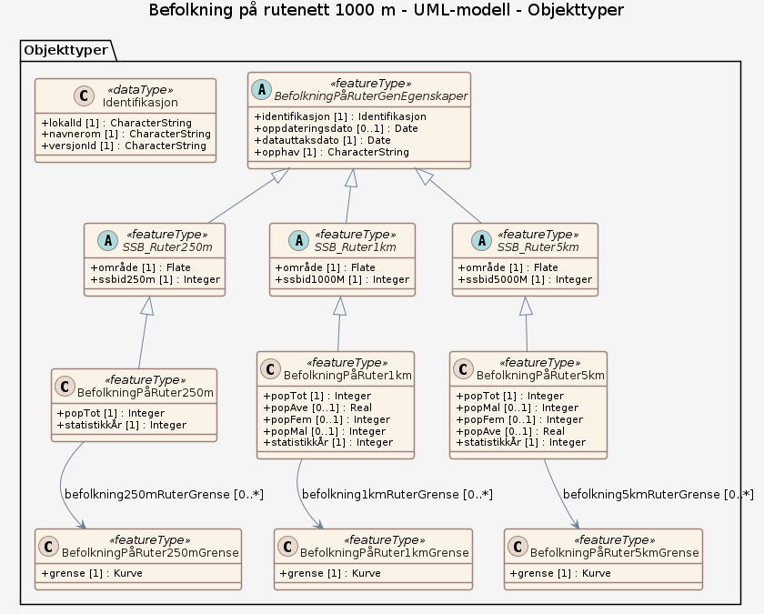

# Produktspesifikasjon: Befolkning på rutenett 1000 m

*Viser bosatte på ruter 1000 m x 1000 m, for gjeldende år og historiske versjoner siden 2001. Grunnlaget for dataene er folkeregistrert befolkning knyttet mot adressepunkter i Matrikkelen. Dette er summert til rutenett,  hvor variabelen "totalt bosatte" gis.

Bosatte på ruter finnes også for inndelingene 250m X 250m og 5km x 5km.  For 5km x 5km gis flere variabler : antall menn, antall kvinner, og snittalder i ruta. 

Årsdatasett er nedlastbar både fra Geonorge og i SSBs kartportal <https://kart.ssb.no>  > Se eget Tema "Befolkning" eller gå til "Innholdskatalog" og  søk på "befolkning" for oversikt over alle datasett*

**Nøkkelord:** befolkning, befolkningstetthet, Befolkningsfordeling, Norge digitalt, geodataloven, Inspire, fellesDatakatalog

**Emnekategorier:** Samfunn og kultur

**Geografisk utstrekning**:

- **Vest**: 2.0
- **Øst**: 33.0
- **Sør**: 57.0
- **Nord**: 72.0

**Tidsmessig utstrekning**:

- **Tidsperiode**:
  - **Fra**: 2020-05-07
  - **Til**: 2020-05-07

## Om spesifikasjonen

> **Denne versjonen av produktspesifikasjonen:**  
> **Opprettet dato:** 2020-05-07 
> **Endret dato:** 2020-05-07 
> **Språk:** nor 
> **Kontaktinformasjon:** Statistisk sentralbyrå, [vilni.verner.holst.bloch@ssb.no](mailto:vilni.verner.holst.bloch@ssb.no)

## Om produktet Befolkning på rutenett 1000 m

> **Romlig representasjonstype:** Vektor 
> **Unik identifikator:** <https://data.geonorge.no/sosi/befolkning/befolkning_rutenett_1000> 
> **Kontaktinformasjon:** Statistisk sentralbyrå, [vilni.verner.holst.bloch@ssb.no](mailto:vilni.verner.holst.bloch@ssb.no)
>
> **Romlig oppløsning:**
>
> **Ekvivalent målestokk**: 250000
>
> **Begrensninger:**
>
> **Ressursbegrensninger**:
>
> - **Bruksbegrensninger**: Ingen begrensninger på bruk er oppgitt.
>
> **Juridiske begrensninger**:
>
> - **Tilgangsbegrensninger**: Åpne data
> - **Bruksbegrensninger**: Lisens
> - **Lisens**: Norsk lisens for offentlige data (NLOD)
> - **Lisenslenke**: <http://data.norge.no/nlod/no/1.0>
>
> **Sikkerhetsbegrensninger**:
>
> - **Klassifisering**: Ugradert

### Formål

Analyse, plan

### Bruksområde

Dataene gir oversikt over befolkningsfordelingen i Norge. Dataene egner seg for framstilling av temakart, oversiktskart, kartløsninger på internett og til geografiske analyser.

## Omfang

### Hele datasettet

**Nivå**: dataset

**Nivåbeskrivelse**: Gjelder hele datasettet. Hvis omfang ikke er oppgitt under en overskrift, gjelder teksten for hele datasettet og alle leveranser

### UML-modell

**Nivå**: dataset

## Datainnhold og struktur

### Datamodell - UML-modell

➡️ [Se full datamodell for omfang "UML-modell" (diagram per pakke og objektkatalog)](uml-modell/objektkatalog.html)

## Referansesystem

| EPSG-kode | Navn på referansesystem |
| --- | --- |
| [EPSG:25833](https://epsg.io/25833) | [EUREF89 UTM sone 33, 2d](https://register.geonorge.no/epsg-koder) |
| [EPSG:3035](https://epsg.io/3035) | [EUREF89 / ETRS89-LAEA Europe](https://register.geonorge.no/epsg-koder) |
| [EPSG:4258](https://epsg.io/4258) | [EUREF 89 Geografisk (ETRS 89) 2d](https://register.geonorge.no/epsg-koder) |

## Datakvalitet

**Nivå**: series

- **Kvalitetsmål**: COMMISSION REGULATION (EU) No 1089/2010 of 23 November 2010 implementing Directive 2007/2/EC of the European Parliament and of the Council as regards interoperability of spatial data sets and services
  **Målebeskrivelse**: Dataene er ikke vurdert iht produktspesifikasjonen
  **Beskrivende resultat**: Dataene er ikke vurdert iht produktspesifikasjonen

- **Kvalitetsmål**: SOSI produktspesifikasjon: Befolkning på rutenett
  **Målebeskrivelse**: Dataene er i henhold til produktspesifikasjonen
  **Beskrivende resultat**: Dataene er i henhold til produktspesifikasjonen

- **Kvalitetsmål**: Sosi applikasjonsskjema
  **Målebeskrivelse**: SOSI-filer er ikke vurdert i henhold til applikasjonsskjema
  **Beskrivende resultat**: SOSI-filer er ikke vurdert i henhold til applikasjonsskjema

- **Kvalitetsmål**: Sosi applikasjonsskjema
  **Målebeskrivelse**: GML-filer er ikke vurdert i henhold til applikasjonsskjema
  **Beskrivende resultat**: GML-filer er ikke vurdert i henhold til applikasjonsskjema

## Datafangst og produksjon

**Datainnsamling og prosessering**:

- **Prosesstrinn**:
  - **Beskrivelse**: Baseres på informasjon fra Det sentrale folkeregisteret (statistisk ekvivalent) og Matrikkelen.

## Vedlikehold

**Vedlikeholdsfrekvens**: Årlig

**Status**: Fullført

## Presentasjon

**navn**: Tegneregler

**Lenke**:
<https://register.geonorge.no/register/versjoner/tegneregler/statistisk-sentralbyra/befolkning-pa-rutenett-1000m>

## Leveranse

| Tjeneste | Endepunkt | Type | Format | Leveranseenheter |
| --- | --- | --- | --- | --- |
| Geonorge nedlastning | [Lenke](https://nedlasting.geonorge.no/api/capabilities/) | GEONORGE:DOWNLOAD | GML, SOSI, FGDB, PostGIS | fylkesvis, landsfiler, kommunevis |
| Egen nedlastningsside | [Lenke](https://kart.ssb.no.) | WWW:DOWNLOAD-1.0-http--download | Shape, Parquet, GML, GeoJSON | landsfiler, fylkesvis, kommunevis, cellevis |
| Befolkning på rutenett WMS, fra kart.ssb.no | [Lenke](https://kart.ssb.no/api/mapserver/v1/wms/befolkning_paa_rutenett?service=WMS&version=1.3.0&request=GetCapabilities) | WMS-tjeneste | GML |  |
| GeoPackage: uml-modell | [Lenke](https://raw.githubusercontent.com/ToreFreddyB/produktspesifikasjon_ssb/main/produktspesifikasjon/befolkning-pa-rutenett/uml-modell/uml-modell.gpkg) | Nedlasting | GPKG |  |

## Metadata

**Metadatastandard**: ISO19115

**Metadatastandardversjon**: 2003

**Metadatadato**: 2026-09-01

**språk**: nor

**Kontakt**:

- **Organisasjon**: Statistisk sentralbyrå
- **Logo**: <https://register.geonorge.no/data/organizations/971526920_SSB_liten.png>
- **Epost**: svein.reid@ssb.no
- **rolle**: pointOfContact

**Metadataidentifikator**:

- **Utsteder**: Geonorge
- **kode**: 38b714b5-6251-41df-8dd9-f0cde540ac03
- **koderom**: <https://kartkatalog.geonorge.no/metadata/>
- **Metadatalenke**: <https://kartkatalog.geonorge.no/metadata/38b714b5-6251-41df-8dd9-f0cde540ac03>

## Tilleggsinformasjon

- **Produktark:** [https://register.geonorge.no/register/versjoner/produktark/statistisk-sentralbyra/befolkningsstatistikk-pa-rutenett](https://register.geonorge.no/register/versjoner/produktark/statistisk-sentralbyra/befolkningsstatistikk-pa-rutenett)
- **Produktside:** [https://www.ssb.no/befolkning](https://www.ssb.no/befolkning)
